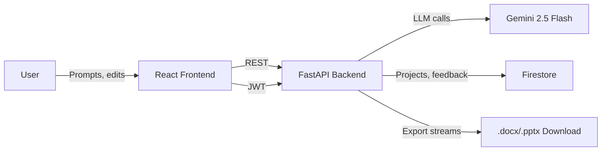
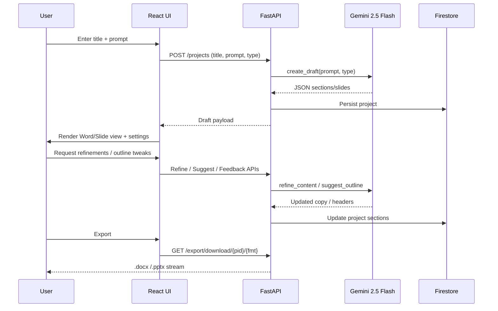

# DraftEngine

DraftEngine helps teams spin up professional Word documents and presentation decks in minutes. It stitches together a Vite/React UI, a FastAPI backend, Google Gemini for generation/refinement, and Firebase/Firestore for persistence and auth context.

## Architecture at a Glance



## Installation & Setup

1. **Clone & prerequisites**
   - Node.js 18+, npm 10+
   - Python 3.11+
   - A Google Cloud project with Gemini API enabled
   - A Firebase project with Firestore (native mode) and a service account JSON
2. **Backend**
   ```bash
   cd backend
   python -m venv .venv
   .\.venv\Scripts\activate  # Windows
   pip install -r requirements.txt
   ```
3. **Frontend**
   ```bash
   cd frontend
   npm install
   ```

## Environment Variables

| Scope | Variable | Description |
| --- | --- | --- |
| Backend `.env` | `GEMINI_API_KEY` | Server-side key for Google Generative AI (Gemini 2.5 Flash). |
|  | `FIREBASE_CRED_PATH` | Absolute or relative path to the Firebase serviceAccount JSON used by `firebase_admin`. |
|  | `SECRET_KEY` | JWT signing key for access tokens. |
|  | `ALGORITHM` | JWT algorithm, defaults to `HS256`. |
|  | `ACCESS_TOKEN_EXPIRE_MINUTES` | Token TTL (default 30). |
| Frontend `.env` | `VITE_API_BASE_URL` | URL to the FastAPI server (e.g., `http://127.0.0.1:8000`). |
|  | `VITE_FIREBASE_API_KEY` | Firebase web API key for client SDK usage. |
|  | `VITE_FIREBASE_AUTH_DOMAIN` | Firebase auth domain. |
|  | `VITE_FIREBASE_PROJECT_ID` | Firebase project id. |
|  | `VITE_FIREBASE_STORAGE_BUCKET` | Optional Firebase storage bucket id. |
|  | `VITE_FIREBASE_MESSAGING_SENDER_ID` | Firebase messaging sender id. |
|  | `VITE_FIREBASE_APP_ID` | Firebase app id. |

Place `.env` files in `backend/` and `frontend/` respectively. Do **not** commit service account files; point `FIREBASE_CRED_PATH` to an ignored location.

## Running DraftEngine

| Service | Command | Notes |
| --- | --- | --- |
| Backend (FastAPI) | `cd backend && uvicorn app.main:app --reload --port 8000` | Requires `.venv` activated and `.env` loaded. |
| Frontend (Vite) | `cd frontend && npm run dev -- --host` | Visit the URL printed by Vite (defaults to `http://localhost:5173`). |

Ensure the backend port matches `VITE_API_BASE_URL`. The frontend proxies all requests through the axios client in `src/api/client.js`.

## User Registration & Login

1. Open the web UI and head to **Register**.
2. Provide an email + password (password confirmation happens client-side). The frontend calls `POST /auth/register`, which hashes the password and stores it in Firestore.
3. After registration, log in via **Login** page, which invokes `POST /auth/login`.
4. Successful login stores the returned JWT in `localStorage`; the `AuthContext` decodes expiry and attaches the token to every subsequent API call.
5. Logout simply clears `localStorage` and resets context state.

## Configuring a Word Document

- Navigate to an existing project (type `document`) or create a new one by supplying a prompt/title.
- Use the **Document Settings** panel to:
  - Let the AI propose a section outline (`/editor/suggest-outline`), then accept/edit/discard.
  - Add, remove, rename, and reorder sections; order metadata stays in sync with the Word view.
  - Add manual sections if you want to override the AI outline entirely.
- The main **Word View** renders each section with a clean page layout. Every section embeds a **Refinement Box** for AI edits, likes/dislikes, and reviewer notes.
- Click **Export .DOCX** (panel bottom) to stream the current structure through `/export/download/{pid}/docx`.

## Configuring a PowerPoint Document

- Create or open a project of type `slides`.
- The **Presentation Settings** panel lets you:
  - Choose a target slide count; DraftEngine adds/removes slides to match.
  - Request AI slide headers (`/editor/suggest-outline`) or full content (`Generate Slides` leverages `/editor/generate` with `type="slides"`).
  - Manually rename slides, reorder them, and insert/delete slides.
- The **Slide View** gives a WYSIWYG preview with navigation arrows plus a thumbnail strip for quick jumps.
- Use **Export .PPTX** to download a deck built via `python-pptx`, including optional reviewer notes rendered in a footer textbox.

## Content Generation

- **Project creation** (`POST /projects/`): Saves the Gemini draft + metadata in Firestore and returns it to the UI.
- **Ad-hoc generation** (`POST /editor/generate`): Kick off structured content for either documents or slides using the same prompt builder (enforces JSON-only responses, minimum section count).
- **Outline suggestions** (`POST /editor/suggest-outline`): Lightweight call that only returns headers, perfect for brainstorming before filling content.
- Generated sections are normalized via `DocGenService` so the UI always receives a clean `[{ id, title, content, order }]` array.

## Refinement (AI edits, likes/dislikes, comments)

- Each section surfaces a **Refinement Box**:
  - `Refine` sends the section body plus user instructions to `/editor/refine`. The Gemini response replaces the section content inline.
  - `ThumbsUp/ThumbsDown` call `/editor/feedback/{pid}/{sid}`, storing reviewer sentiment alongside the section in Firestore.
  - Comments persist through `/editor/comment/{pid}/{sid}` so collaborators can leave lightweight review notes.
- States (`feedback`, `comment`) travel with export files: DOCX paragraphs append “Note:” callouts and PPTX slides add a footer textbox.

## Exporting .DOCX and .PPTX

1. Ensure the project is saved (creation automatically persists the latest structure).
2. Hit **Download .DOCX** or **Download .PPTX** anywhere in the editor (Toolbar buttons mirror the settings panels).
3. The backend fetches the project from Firestore, runs `ExportService.gen_docx` or `gen_pptx`, and streams the file with appropriate MIME headers.
4. Notes/comments are embedded directly in the exported files, so reviewers see context even offline.

## AI-Generated Template Workflow



### Steps in plain language

1. **Start** with a prompt + type; DraftEngine bootstraps a template using Gemini.
2. **Shape the outline** via AI suggestions or manual edits in Document/Presentation Settings.
3. **Fill content** using AI generations, then fine-tune paragraphs or slides with Refinement Boxes.
4. **Capture review signals** through likes/dislikes plus comments—they feed back into Firestore and exports.
5. **Export** polished `.docx` or `.pptx` files to share downstream.

---


